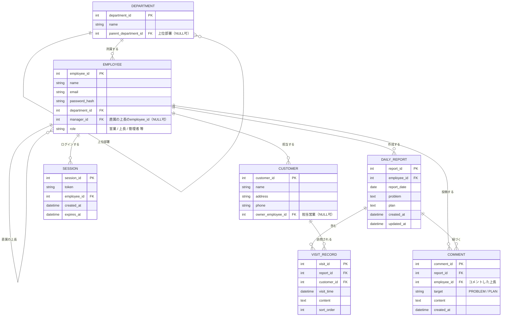

# 営業日報システム 要件定義書

## 1. 目的

営業担当者が日々の訪問活動・課題・翌日の予定を報告し、上長が内容を確認してコメント（フィードバック）できる仕組みを提供する。これにより、営業活動の可視化と上長・部下間のコミュニケーションの円滑化を図る。

## 2. 用語定義

| 用語 | 説明 |
|---|---|
| 日報 | 営業担当者が1日単位で作成する報告書。訪問記録・Problem・Planから構成される |
| 訪問記録 | 日報に紐づく、顧客ごとの訪問内容の記録。1日報につき複数行登録可能 |
| Problem | 日報内に記載する、現在の課題・相談事項 |
| Plan | 日報内に記載する、翌営業日にやること |
| コメント | 上長がProblem/Planに対して行うフィードバック。スレッド形式で複数人・複数回可能 |
| 顧客マスタ | 訪問対象となる顧客情報を管理するマスタ |
| 営業マスタ（社員マスタ） | 営業担当者・上長を含む社員情報を管理するマスタ |
| 部署マスタ | 組織（部署・チーム）を管理するマスタ |

## 3. アクター（利用者ロール）

| ロール | 説明 |
|---|---|
| 営業担当者 | 日報を作成・編集する。自分の日報にのみ書き込み可能 |
| 上長 | 部下（自分が manager となっている社員）の日報を閲覧し、Problem/Planにコメントできる |
| 管理者 | 顧客マスタ・社員マスタ・部署マスタを保守する |

※ 1人の社員が「営業担当者」でありかつ他の社員の「上長」であるケースを許容する（例: プレイングマネージャー）。

## 4. 機能要件

### 4.1 日報機能
- F-01: 営業担当者は、日付・訪問記録（複数行）・Problem・Planを入力し、日報として保存できる
- F-02: 1営業担当者・1日につき、日報は1件のみ作成できる（同一日に複数の日報は作れない）
- F-03: 日報は作成後も本人が編集できる（ステータス管理は行わないため、提出後も自由に修正可能）

### 4.2 訪問記録機能
- F-10: 訪問記録には「顧客（顧客マスタから選択）」「訪問日時」「訪問内容（自由記述）」を入力する
- F-11: 訪問記録は1日報につき複数行追加できる（同じ顧客への複数回訪問も可）

### 4.3 Problem / Plan 機能
- F-20: 営業担当者は日報ごとにProblem（課題・相談）とPlan（翌日やること）を自由記述で入力する

### 4.4 コメント機能
- F-30: 上長（自分の部下の日報に限る）は、Problem/Planに対してコメントを投稿できる
- F-31: コメントはスレッド形式とし、複数の上長・複数回のやり取りを時系列で記録する
- F-32: どのコメントが誰によっていつ投稿されたかを表示する

### 4.5 マスタ管理機能
- F-40: 管理者は顧客マスタ（顧客の登録・編集）を管理できる
- F-41: 管理者は社員マスタ（社員の登録・編集、所属部署、直属上長の設定）を管理できる
- F-42: 管理者は部署マスタ（部署の登録・編集、部署階層）を管理できる

## 5. 業務ルール・制約

- 日報の一意性: `(社員ID, 日付)` の組で一意
- 閲覧・コメント権限: 上長は自分が直属の上長になっている社員の日報のみコメント可能（他部署の日報は閲覧・コメント不可）
- ステータス管理は設けない（提出→承認のような状態遷移は本バージョンでは対象外）

## 6. データモデル（ER図）

### テーブル補足

- **DEPARTMENT**: `parent_department_id` により部署階層（例: 本部＞部＞課）を表現。階層が不要な場合はこの列を使わずフラットに運用可能
- **EMPLOYEE**: 営業マスタに相当。`manager_id` の自己参照で上長・部下関係を表現するため、別テーブルに分けていない。`password_hash` はログイン認証用（scryptによるハッシュ値。平文パスワードは保存しない）
- **SESSION**: `api_specification.md` 1.2のBearerトークン方式を実現するためのログインセッション管理テーブル。`token` はopaqueなランダム文字列で、ログアウト時に該当行を削除することで即時失効させる。`expires_at` を過ぎたセッションは無効として扱う（有効期限は24時間固定。リフレッシュ方式は7章の今後の検討事項）
- **CUSTOMER**: `owner_employee_id` は主担当営業（任意項目）。将来的に複数担当制にする場合は中間テーブル化を検討
- **DAILY_REPORT**: Problem/Planは複数行管理ではなく1件ずつのテキスト項目。`(employee_id, report_date)` に一意制約を付与
- **VISIT_RECORD**: 1日報に複数行ぶら下がる。`sort_order` は同日内の表示順管理用（任意）
- **COMMENT**: `target` 列でProblem宛かPlan宛かを区別。スレッド形式のため同一日報・同一targetに複数コメントが時系列で並ぶ

## 7. 今後の検討事項（本バージョンでは対象外）

- 日報の提出・承認ステータス管理
- 訪問記録と案件（商談）マスタとの連携
- 顧客の複数担当営業への対応（中間テーブル化）
- コメントへの既読管理・通知機能
