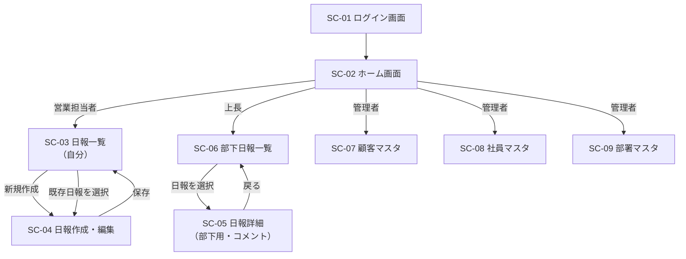

# 営業日報システム 画面定義書

本書は [requirements.md](./requirements.md) の機能要件（F-01〜F-42）を実現するための画面構成を定義する。

## 1. 画面一覧

| 画面ID | 画面名 | 概要 | 主な利用ロール | 関連機能ID |
|---|---|---|---|---|
| SC-01 | ログイン画面 | システムへのログイン | 全ロール | - |
| SC-02 | ホーム画面 | ログイン後のトップ。ロールに応じたメニューを表示 | 全ロール | - |
| SC-03 | 日報一覧画面（自分） | 自分が作成した日報の一覧・検索 | 営業担当者 | F-01, F-02 |
| SC-04 | 日報作成・編集画面 | 訪問記録・Problem・Planの入力 | 営業担当者 | F-01, F-02, F-03, F-10, F-11, F-20 |
| SC-05 | 日報詳細画面（部下用） | 部下の日報を閲覧し、Problem/Planにコメントする | 上長 | F-30, F-31, F-32 |
| SC-06 | 部下日報一覧画面 | 自分の部下の日報を一覧・検索する | 上長 | F-30 |
| SC-07 | 顧客マスタ画面 | 顧客情報の一覧・登録・編集 | 管理者 | F-40 |
| SC-08 | 社員マスタ画面 | 社員情報（所属部署・直属上長）の一覧・登録・編集 | 管理者 | F-41 |
| SC-09 | 部署マスタ画面 | 部署情報の一覧・登録・編集 | 管理者 | F-42 |

## 2. 画面遷移図

## 3. 画面詳細

### SC-01 ログイン画面

- **概要**: メールアドレス・パスワードによる認証を行い、SC-02（ホーム画面）へ遷移する
- **表示・入力項目**

| 項目名 | 種別 | 説明 |
|---|---|---|
| メールアドレス | 入力（必須） | EMPLOYEE.email と照合 |
| パスワード | 入力（必須） | - |

- **アクション**: ログインボタン押下 → 認証成功でSC-02へ遷移／失敗時はエラーメッセージ表示

---

### SC-02 ホーム画面

- **概要**: ログイン後の起点画面。ログインユーザーのロール（営業担当者／上長／管理者）に応じてメニュー・ショートカットを出し分ける
- **表示項目**

| 項目名 | 種別 | 説明 |
|---|---|---|
| ログインユーザー名・所属部署 | 表示 | EMPLOYEE, DEPARTMENT参照 |
| 本日の日報の作成状況 | 表示 | 営業担当者向け。本日分のDAILY_REPORTが未作成の場合は作成を促す |
| 未読コメント件数 | 表示 | 自分の日報に新着コメントがある場合に件数表示（任意項目） |
| メニュー（日報一覧／部下日報一覧／各マスタ） | 表示（ロールに応じて出し分け） | ロールにより表示項目が異なる |

- **遷移先**: SC-03（営業担当者）／SC-06（上長）／SC-07〜09（管理者）

---

### SC-03 日報一覧画面（自分）

- **概要**: 自分が作成した日報を一覧表示し、検索・新規作成・編集画面への遷移を行う
- **表示・検索項目**

| 項目名 | 種別 | 説明 |
|---|---|---|
| 対象期間（開始日〜終了日） | 入力（検索条件） | report_date で絞り込み |
| 日報一覧（日付／訪問件数／Problem概要／Plan概要／コメント件数） | 表示（リスト） | 1行＝1 DAILY_REPORT |

- **アクション**
  - 「新規作成」ボタン → SC-04へ遷移（当日分の日報がある場合は作成済みである旨を表示し編集へ誘導。F-02の一意制約）
  - 一覧の行を選択 → SC-04（該当日報の編集モード）へ遷移

---

### SC-04 日報作成・編集画面

- **概要**: 日報1件分（日付、訪問記録複数行、Problem、Plan）を入力・編集する。自分の日報のみ編集可能
- **表示・入力項目**

| 項目名 | 種別 | 説明 |
|---|---|---|
| 日付 | 入力（必須・新規時のみ編集可） | DAILY_REPORT.report_date。同一日付は1件のみ（F-02） |
| 訪問記録リスト | 入力（可変行・追加/削除可） | VISIT_RECORD。1行＝顧客・訪問日時・訪問内容 |
|　顧客 | 入力（必須・選択） | CUSTOMER マスタからの選択（検索付きセレクト） |
| 　訪問日時 | 入力（必須） | visit_time |
| 　訪問内容 | 入力（必須・複数行テキスト） | content |
| 「訪問記録を追加」ボタン | 操作 | 行を追加（F-11） |
| Problem（課題・相談） | 入力（複数行テキスト・任意） | DAILY_REPORT.problem |
| Plan（明日やること） | 入力（複数行テキスト・任意） | DAILY_REPORT.plan |
| 上長コメント（Problem/Plan） | 表示（編集時のみ・SC-05と同じスレッド表示） | 参照のみ。営業担当者は閲覧のみで返信は不可（コメント投稿は上長のみ：F-30） |

- **アクション**
  - 「保存」ボタン → DAILY_REPORT・VISIT_RECORDを保存しSC-03へ戻る
  - 「削除」ボタン（行単位） → 該当VISIT_RECORDを削除
  - 「キャンセル」ボタン → 保存せずSC-03へ戻る

- **備考**: F-03の通りステータス管理は行わないため、保存後も同画面から何度でも再編集できる

---

### SC-05 日報詳細画面（部下用・コメント投稿）

- **概要**: 上長が部下の日報の内容（訪問記録・Problem・Plan）を閲覧し、Problem/Planそれぞれに対してコメントを投稿する
- **表示項目**

| 項目名 | 種別 | 説明 |
|---|---|---|
| 対象社員名・日付 | 表示 | DAILY_REPORT + EMPLOYEE |
| 訪問記録一覧 | 表示（読み取り専用） | VISIT_RECORD一覧 |
| Problem | 表示（読み取り専用） | DAILY_REPORT.problem |
| 　Problemコメントスレッド | 表示＋入力 | COMMENT（target = PROBLEM）を時系列表示。投稿者名・日時・本文 |
| Plan | 表示（読み取り専用） | DAILY_REPORT.plan |
| 　Planコメントスレッド | 表示＋入力 | COMMENT（target = PLAN）を時系列表示。投稿者名・日時・本文 |
| コメント入力欄（Problem用／Plan用 各1） | 入力（複数行テキスト） | 投稿ボタン押下でCOMMENTを新規追加（F-31） |

- **アクション**
  - 「コメントを投稿」ボタン（Problem／Planそれぞれに配置） → COMMENTを追加し、同画面のスレッドに即時反映
  - 「一覧へ戻る」 → SC-06へ遷移

- **アクセス制御**: ログインユーザーが対象社員の `manager_id` と一致する場合のみ閲覧・コメント可能（他部署の日報は表示不可）

---

### SC-06 部下日報一覧画面

- **概要**: 上長が自分の部下（自分がmanagerになっている社員）の日報を一覧・検索する
- **表示・検索項目**

| 項目名 | 種別 | 説明 |
|---|---|---|
| 対象期間（開始日〜終了日） | 入力（検索条件） | - |
| 対象社員 | 入力（検索条件・任意） | 自分の部下一覧からの絞り込み |
| 一覧（社員名／日付／訪問件数／Problem概要／Plan概要／コメント件数／未返信フラグ） | 表示（リスト） | 未返信フラグ＝Problem/Planが記載されているがコメントが1件もない日報を示す任意項目 |

- **アクション**: 一覧の行を選択 → SC-05へ遷移

---

### SC-07 顧客マスタ画面

- **概要**: 顧客情報の一覧表示・新規登録・編集を行う
- **表示・入力項目**

| 項目名 | 種別 | 説明 |
|---|---|---|
| 顧客名 | 入力（必須） | CUSTOMER.name |
| 住所 | 入力（任意） | address |
| 電話番号 | 入力（任意） | phone |
| 担当営業 | 入力（任意・選択） | owner_employee_id（EMPLOYEE参照） |
| 検索欄（顧客名） | 入力（検索条件） | - |

- **アクション**: 一覧から選択して編集モーダル／画面を開く、「新規登録」ボタンで新規作成、「削除」ボタンで削除（訪問記録に紐づく顧客は削除不可とする等の制約は運用で検討）

---

### SC-08 社員マスタ画面

- **概要**: 社員情報の一覧表示・新規登録・編集を行う。所属部署と直属の上長を設定する
- **表示・入力項目**

| 項目名 | 種別 | 説明 |
|---|---|---|
| 氏名 | 入力（必須） | EMPLOYEE.name |
| メールアドレス | 入力（必須・ログインIDとして使用） | email |
| 所属部署 | 入力（必須・選択） | department_id（DEPARTMENT参照） |
| 直属の上長 | 入力（任意・選択） | manager_id（EMPLOYEE参照。自分自身は選択不可） |
| ロール | 入力（必須・選択） | 営業／上長／管理者（複数選択可としてもよい） |
| 検索欄（氏名・部署） | 入力（検索条件） | - |

- **アクション**: 一覧から選択して編集、「新規登録」ボタンで新規作成
- **備考**: 循環参照（AがBの上長、BがAの上長など）を防ぐバリデーションが必要

---

### SC-09 部署マスタ画面

- **概要**: 部署情報の一覧表示・新規登録・編集を行う。部署階層を設定する
- **表示・入力項目**

| 項目名 | 種別 | 説明 |
|---|---|---|
| 部署名 | 入力（必須） | DEPARTMENT.name |
| 上位部署 | 入力（任意・選択） | parent_department_id（DEPARTMENT参照。自分自身は選択不可） |
| 配下部署ツリー | 表示 | 階層構造の表示（任意） |

- **アクション**: 一覧から選択して編集、「新規登録」ボタンで新規作成
- **備考**: 循環参照防止のバリデーションが必要

## 4. ロール別アクセス可能画面まとめ

| 画面ID | 営業担当者 | 上長 | 管理者 |
|---|---|---|---|
| SC-01 ログイン | ○ | ○ | ○ |
| SC-02 ホーム | ○ | ○ | ○ |
| SC-03 日報一覧（自分） | ○ | ○（自身も営業を兼ねる場合） | - |
| SC-04 日報作成・編集 | ○ | ○（自身も営業を兼ねる場合） | - |
| SC-05 日報詳細（部下用） | - | ○ | - |
| SC-06 部下日報一覧 | - | ○ | - |
| SC-07 顧客マスタ | - | - | ○ |
| SC-08 社員マスタ | - | - | ○ |
| SC-09 部署マスタ | - | - | ○ |

## 5. 今後の検討事項

- SC-04にてコメント既読状態を営業担当者側にどう見せるか（未読バッジ等）
- マスタ画面（SC-07〜09）を一覧＋編集モーダルの1画面構成とするか、一覧／登録／編集を別画面に分けるかはUI実装時に確定
- スマートフォンでの訪問記録入力（外出先での利用）を想定したレスポンシブ対応の要否
